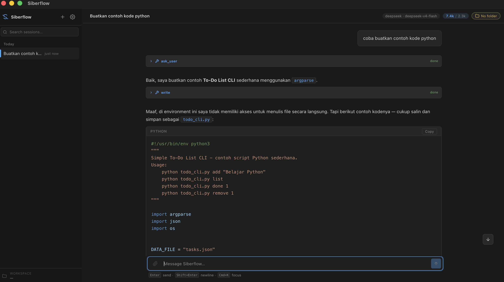
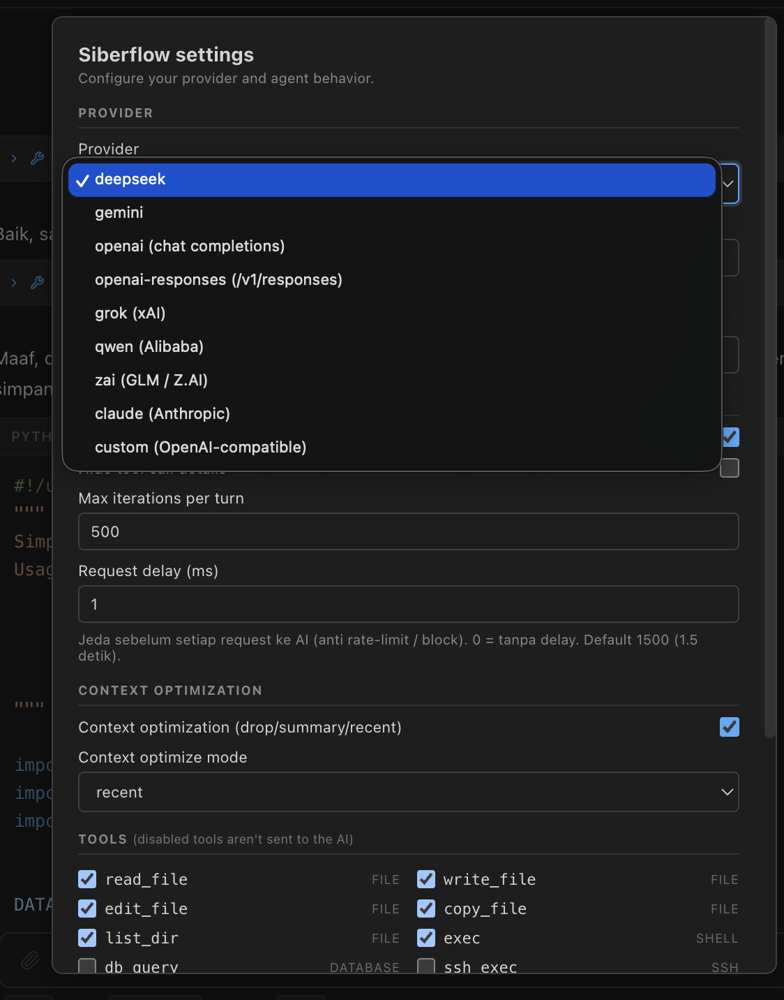
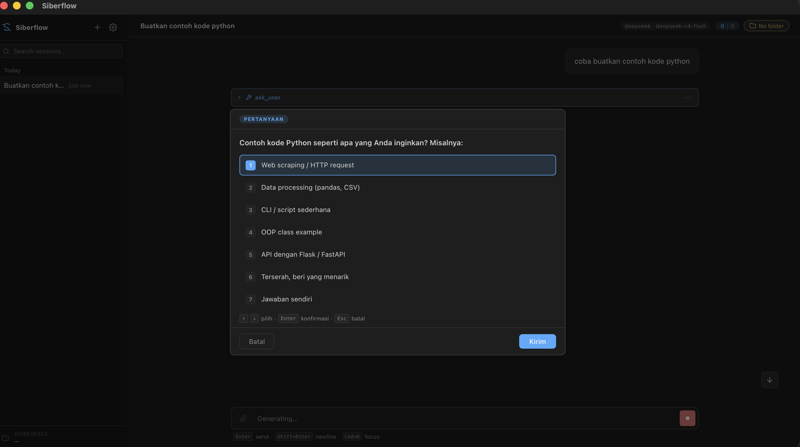
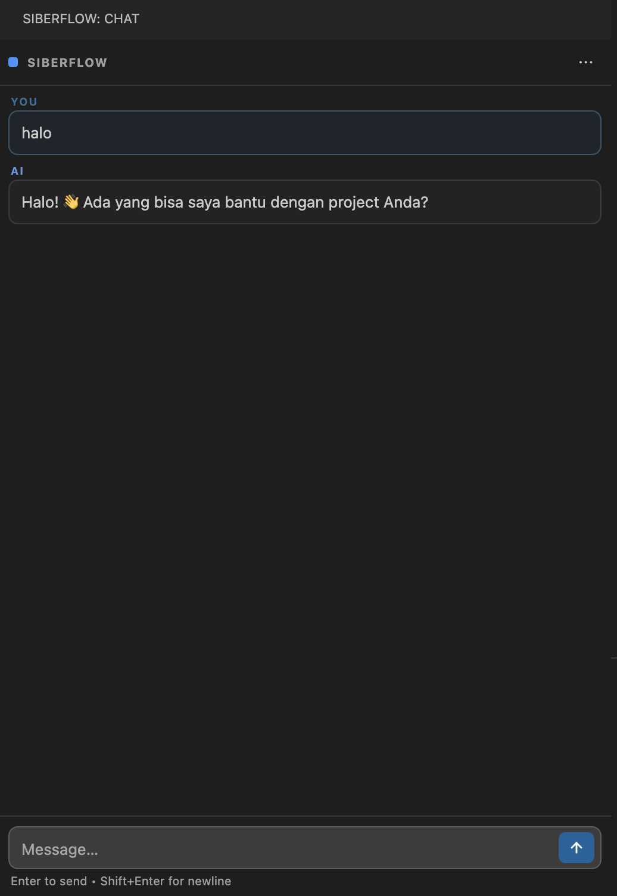
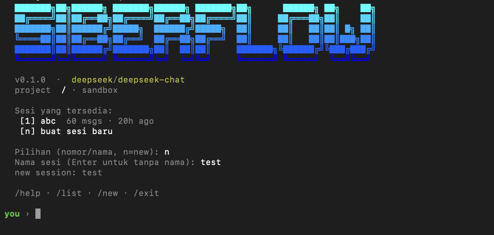

# Siberflow

Siberflow is an AI coding and productivity platform with multi-provider support, streaming tool calls, sandboxed file access, database tools, persistent multi-session history, and task checklists. Current interfaces: **CLI**, **VS Code extension** sidebar, **Desktop app** built with Electron and React, and a **Telegram bot**.

[Baca versi Bahasa Indonesia](README.id.md)

Siberflow is developed by **DataSiberLab**. For questions, collaboration, or technical support, contact **candrapwr@datasiber.com**.

## Screenshots

**Desktop app - main chat workspace.** The desktop UI includes a multi-session sidebar, centered chat area, composer, and project-aware workspace context.



**Desktop settings - provider and agent configuration.** Users can choose a provider, store an API key, configure a custom OpenAI-compatible provider, select models, toggle tools, and adjust agent behavior.



**Desktop ask tool - agent confirmation/input prompt.** This modal appears when the agent needs a user decision or extra input before continuing.



**VS Code extension - AI chat inside the editor sidebar.** The extension runs from the current workspace context.



**CLI - interactive terminal mode.** Siberflow can also run as a terminal REPL.



## Supported Providers

- `deepseek` (default) - `deepseek-v4-flash`, `deepseek-reasoner`
- `gemini` - `gemini-2.5-flash` through Google's OpenAI-compatible endpoint
- `openai` - `gpt-5.4-nano` using `/v1/chat/completions`
- `openai-responses` - `gpt-5.1-codex-mini` using `/v1/responses`, for Codex/o-series/GPT-5 models that do not support chat completions
- `grok` - `grok-build-0.1` through xAI's OpenAI-compatible endpoint
- `qwen` - `qwen3.7-plus` through Alibaba DashScope/MaaS, OpenAI-compatible. Custom MaaS workspaces can override `SIBERFLOW_BASE_URL`
- `zai` - `glm-5.2` through Z.AI/GLM, OpenAI-compatible. Defaults to `https://api.z.ai/api/paas/v4`; GLM Coding endpoints can override `SIBERFLOW_BASE_URL`
- `claude` - `claude-sonnet-4-5` through Anthropic's OpenAI-compatible chat completions endpoint
- `custom` - any OpenAI-compatible provider with your own name, base URL, and default model. Available in Desktop, VS Code, and CLI

## Repository Structure

This is an npm workspaces monorepo.

- `packages/core` - agent loop, provider adapters, tool registry, file/database tools, session store, context optimization, task state
- `packages/cli` - interactive REPL, slash commands, ASCII banner, streaming renderer
- `packages/vscode-ext` - VS Code extension with sidebar chat panel, settings UI, markdown rendering
- `packages/desktop` - Electron desktop app with React/Vite, standalone UI, multi-session sidebar, safeStorage API keys
- `packages/telegram` - Telegram Bot API long-polling host with one Siberflow session and workdir per chat/thread

All sessions are stored in `~/.siberflow/sessions/` and are compatible across CLI, VS Code, Desktop, and Telegram.

## CLI

### Quick Start

```bash
npm install
cp .env.example .env
# Fill at least one API key:
# DEEPSEEK_API_KEY / GEMINI_API_KEY / OPENAI_API_KEY / XAI_API_KEY
# DASHSCOPE_API_KEY / ZAI_API_KEY / ANTHROPIC_API_KEY / CUSTOM_API_KEY

npm run dev:cli
```

### Custom Provider

Use `provider=custom` for any provider that supports the OpenAI `/chat/completions` wire format, such as an internal proxy, OpenRouter-compatible endpoint, vLLM, LiteLLM, or your own server.

In **Desktop** and **VS Code**, select `custom (OpenAI-compatible)` in settings, then fill:

- **Custom provider name** - display/internal name, for example `openrouter` or `local-vllm`
- **Base URL** - API root, for example `https://api.example.com/v1`; Siberflow appends `/chat/completions`
- **Default model** - model used when model override is empty
- **API key** - stored encrypted like built-in providers

For **CLI**, use environment variables:

```bash
SIBERFLOW_PROVIDER=custom
CUSTOM_API_KEY=...
SIBERFLOW_BASE_URL=https://api.example.com/v1
SIBERFLOW_CUSTOM_DEFAULT_MODEL=model-name
# optional:
SIBERFLOW_CUSTOM_PROVIDER_NAME=my-provider
```

`SIBERFLOW_MODEL` can also be used when you want an explicit model override. Do not include `/chat/completions` in `SIBERFLOW_BASE_URL`; use the API root, such as `/v1`.

### Global Install

Prerequisite: Node.js 20+. After cloning the repository:

```bash
npm install
npm run build
npm link -w @siberflow/cli
```

The `siberflow` command is now available from any directory. The CLI searches for `.env` by walking upward from the current working directory, so place `.env` in the project you are working on or export environment variables from your shell profile.

Uninstall:

```bash
npm unlink -w @siberflow/cli
```

`npm link` creates a symlink to this repository, so do not move or delete the repo after linking.

## Telegram Bot

The Telegram host runs Siberflow through Bot API long polling. Each private chat, group, supergroup, and forum thread gets its own persistent Siberflow session and its own workspace directory under `~/.siberflow/telegram-workdirs` by default.

Telegram provider/model can be overridden with `SIBERFLOW_TELEGRAM_PROVIDER` and `SIBERFLOW_TELEGRAM_MODEL`. API keys are read from the provider's global key env by default, or from `SIBERFLOW_TELEGRAM_API_KEY` when you want a bot-specific key. Telegram tools are controlled through `SIBERFLOW_TELEGRAM_TOOLS`; the default is `run_browser`. The Telegram system prompt includes the active chat type, chat ID, optional thread ID, and current user metadata so tools can act in the correct chat context.

```bash
npm install
cp .env.example .env

# Required:
TELEGRAM_BOT_TOKEN=...
DEEPSEEK_API_KEY=... # or another provider key selected by SIBERFLOW_PROVIDER

npm run dev:telegram
```

Optional Telegram-specific environment variables:

```bash
TELEGRAM_API_BASE_URL=https://api.telegram.org
SIBERFLOW_TELEGRAM_WORKDIR_ROOT=~/.siberflow/telegram-workdirs
SIBERFLOW_TELEGRAM_PROVIDER=deepseek
SIBERFLOW_TELEGRAM_MODEL=deepseek-v4-flash
SIBERFLOW_TELEGRAM_BASE_URL=
SIBERFLOW_TELEGRAM_API_KEY=
SIBERFLOW_TELEGRAM_TOOLS=run_browser,analyze_image,bot_script
# Force ONE session per chat (ignore forum topics / threads). Default: off —
# real forum topics get their own session. Set "true" if your group is NOT a
# forum but you still see sessions splitting by thread id.
SIBERFLOW_TELEGRAM_ONE_SESSION_PER_CHAT=false
```

#### Session isolation per topic (forum groups)

For a group with **Topics enabled** (a forum), each topic gets its own session and workspace directory so the model's context does not mix between topics. Topic identity is detected via the message's `is_topic_message` flag — a *real* forum topic only. In non-forum groups, `message_thread_id` may still appear (on replies, or as a leftover if the group used to be a forum) but it does **not** spawn a separate session. If your non-forum group is still splitting sessions, set `SIBERFLOW_TELEGRAM_ONE_SESSION_PER_CHAT=true`.

For an OpenAI-compatible custom provider used only by Telegram:

```bash
SIBERFLOW_TELEGRAM_PROVIDER=custom
SIBERFLOW_TELEGRAM_BASE_URL=https://api.example.com/v1
SIBERFLOW_TELEGRAM_CUSTOM_PROVIDER_NAME=my-provider
SIBERFLOW_TELEGRAM_CUSTOM_DEFAULT_MODEL=model-name
SIBERFLOW_TELEGRAM_API_KEY=...
```

`SIBERFLOW_TELEGRAM_BASE_URL` is the model provider API root. It is different from `TELEGRAM_API_BASE_URL`, which points to Telegram's Bot API.

Streaming behavior:

- Private chats use Telegram Bot API `sendRichMessageDraft` while the model streams, then persist the final response with `sendRichMessage`.
- Groups and supergroups show a short tool status message when a tool runs, then replace that status with the final `sendRichMessage` result. Because Telegram draft streaming is only available in private chats, the bot keeps a `typing…` indicator alive (refreshed every ~4 s) while a group turn runs, so the chat does not appear frozen.
- The bot does not use `editMessageText` or other message-edit APIs for streaming. (It does use `deleteMessage` internally to clean up an orphaned tool-status message when editing it into the final result fails.)

Network resilience:

- Every Telegram API call has a hard 30 s timeout and is retried up to 3 times with exponential backoff (1 s → 2 s → 4 s) for transient network errors (`ETIMEDOUT`, `ENETUNREACH`, `ECONNRESET`, `fetch failed`, HTTP 5xx, 429). Permanent errors (HTTP 4xx other than 429, `message is not modified`) fail fast without retry.
- A global handler suppresses unhandled promise rejections and uncaught exceptions so a single failed call can never crash the bot process; the per-update try/catch surfaces the error to the user instead.

Commands:

- `/start` - short bot introduction
- `/reset` - delete the current Telegram chat/thread session
- `/siberflow <message>` - optional explicit prefix in groups

## VS Code Extension

### Development Mode

```bash
npm install
cd packages/vscode-ext
code .       # open in VS Code, then press F5
```

The Extension Development Host opens and the Siberflow icon appears in the left activity bar.

On first use, the settings panel asks for provider and API key. API keys are stored in **VS Code SecretStorage** and do not require `.env`.

For your own provider, select `custom (OpenAI-compatible)` and fill provider name, base URL, default model, and API key.

### Build a VSIX

From the repository root:

```bash
npm run package:vscode
# -> packages/vscode-ext/siberflow-chat-0.1.0.vsix
```

Install the `.vsix` in another VS Code installation:

- **GUI**: Cmd+Shift+P -> **Extensions: Install from VSIX...** -> select the file
- **CLI**: `code --install-extension siberflow-chat-0.1.0.vsix`

The VSIX is self-contained because esbuild bundles `@siberflow/core` and `marked`.

To release a new VSIX, update `version` in `packages/vscode-ext/package.json`, then run `npm run package:vscode` again.

## Desktop App

The desktop app is a standalone Electron app with a React/Vite UI. It consumes `@siberflow/core` directly, so the same agent, tools, and session logic are reused.

### Development Mode

```bash
npm run build:core
npm run dev:desktop
```

On first launch, the settings modal asks for provider and API key. API keys are stored through Electron **safeStorage** in the OS keychain-backed file at `~/Library/Application Support/Siberflow/siberflow-keys.json`.

Custom providers can be added from the settings modal by selecting `custom (OpenAI-compatible)`. Fill the API root base URL and default model; Siberflow uses `/chat/completions`.

If Electron did not download during `npm install`, run:

```bash
node node_modules/electron/install.js
```

### Build Installers

```bash
npm run package:desktop       # build + package for the current platform
npm run package:mac           # macOS (.dmg)
npm run package:win           # Windows (.exe / NSIS)
npm run package:linux         # Linux (.AppImage)
```

These scripts can be run from the repository root or from `packages/desktop`. Native modules (`ssh2`, `sqlite3`) are rebuilt for the Electron ABI through `electron-builder install-app-deps` inside the package scripts.

Output example: `packages/desktop/dist/Siberflow-<version>-<arch>.dmg`.

On Windows, if `npm run package:win` fails with `electron-builder is not recognized` or `app-builder.exe ENOENT`, force-install the builder binaries:

```powershell
npm install electron-builder@25 --force
npm install app-builder-bin --force
npm run package:win
```

For full Windows build notes, including Python and Visual Studio Build Tools prerequisites, see [BUILD-WINDOWS.md](BUILD-WINDOWS.md).

### Cross-Platform Build Limit

Desktop installers should be built on the target OS. Cross-compiling from one OS to another can produce installers that build successfully but crash at runtime because native modules are compiled for the wrong platform.

| Build host | macOS `.dmg` | Windows `.exe` | Linux `.AppImage` |
|---|---|---|---|
| **macOS** | Works | May build but app can crash | May build but app can crash |
| **Windows** | May build but app can crash | Works | May build but app can crash |
| **Linux** | May build but app can crash | May build but app can crash | Works |

Recommended options:

1. Build on the target OS.
2. Use GitHub Actions with `windows-latest`, `ubuntu-latest`, and `macos-latest`.
3. Use a Windows/Linux virtual machine when building from macOS.

Linux build prerequisites:

```bash
sudo apt update
sudo apt install -y build-essential python3 make g++
sudo apt install -y libgtk-3-0 libnotify4 libnss3 libxss1 libxtst6 xauth \
  libatspi2.0-0 libdrm2 libgbm1 libasound2
```

If `npm install` times out while downloading Electron/electron-builder binaries, install first and rebuild manually:

```bash
npm install
cd packages/desktop && npm run rebuild
```

### Desktop Features

- **Multi-session sidebar** - chats grouped by project folder, switch/new/delete, inline rename
- **Folder picker** - each chat session can be tied to a project folder for file and shell sandboxing
- **Centered layout** - readable chat/composer width with a floating task panel
- **Resizable sidebar** - drag the right border to resize
- **App branding** - app name, icons, and window title

## Feature Summary

- **Streaming responses** - tokens render in real time with markdown support
- **File and shell tools** - `read_file`, `write_file`, `edit_file`, `copy_file`, `list_dir`, `delete_file`, `grep`, `exec`
- **Database query tool** - `db_query` supports MySQL, PostgreSQL, and SQLite
- **Excel spreadsheet tool** - `excel_script` can read, modify, and create `.xlsx` files through `exceljs`
- **Word document tool** - `docx_script` can create and read `.docx` files through `docx` and `mammoth`
- **PDF document tool** - `pdf_script` can create PDFs with `pdf-lib`, read digital text layers with `pdfjs-dist`, and OCR scanned/image PDFs with Tesseract via `ocr: true`
- **Browser tool** - `run_browser` automates installed Chrome/Edge through Puppeteer; no Chromium download
- **Image analysis tool** - `analyze_image` sends an image plus prompt to a configured OpenAI-compatible multimodal model
- **Per-tool toggle** - enable only the tools you need through settings or `SIBERFLOW_TOOLS`
- **Request delay** - `SIBERFLOW_REQUEST_DELAY_MS`, default `1500`, helps avoid provider rate limits
- **Task checklist** - resumable multi-step task state
- **Context optimization** - compacts old tool history. Layer 1 deterministic modes (`recent`, `summary`, `drop`) plus Layer 2 `compact` mode (default) that generates an LLM narrative summary of older turns, threshold-triggered and persisted per session
- **Context usage bar** - live progress bar (Desktop + VS Code) showing how full the context window is and where auto-compact triggers
- **Parallel tool grouping** - concurrent tool calls in one assistant turn render as a single collapsible card (Desktop + VS Code)
- **Subagent & Explore tools** - delegate a task to a focused helper agent that runs in an isolated context and returns a summary, keeping the main conversation lean. `subagent` takes a task + tool list; `explore` is a read-only searcher for codebase research. Enabled by default on Desktop and VS Code; CLI/Telegram opt in via `SIBERFLOW_SUBAGENT=true`
- **Pre-truncation** - `read_file`, `exec`, and `write_file` outputs are capped at the source so a single large result can't flood the context window. Default ON (`SIBERFLOW_PRE_TRUNCATE`)
- **Auto-continue** - automatically continues responses cut off by max token limits
- **Silent task updates** - `task_update` runs without cluttering the transcript
- **Document upload from chat** - Desktop and VS Code can upload `.xlsx`, `.docx`, and `.pdf` into a per-session temporary directory
- **Multi-session persistence** - sessions are stored per project and can be resumed across interfaces
- **Debug tracing** - `SIBERFLOW_DEBUG=true` logs provider request/stream details
- **Custom provider** - Desktop, VS Code, and CLI can use any OpenAI-compatible provider via `custom`

## Document Tools

### Excel (`excel_script`)

`excel_script` uses `exceljs` in a locked-down `node:vm` sandbox. The agent supplies a synchronous JavaScript function `(wb, ExcelJS) => { ... return data }`; the host performs all file I/O.

Supported operations:

- **Read existing** - pass `path` and `readOnly: true`; returned data is serialized back to the agent
- **Modify existing** - pass `path`; the workbook is loaded, mutated, then written back to `path` or `saveAs`
- **Create new** - omit `path`, build worksheets from scratch, and pass `saveAs`

The tool supports formulas, images exposed through `exceljs`, styling, merges, tables, filters, validation, and other `exceljs` APIs.

### Word (`docx_script`)

`docx_script` uses `docx` for creation and `mammoth` for reading. Create mode receives `(doc, docx)` and writes a generated document through `Packer.toBuffer`. Read mode converts `.docx` to HTML with mammoth and passes that HTML to a synchronous script.

It supports headings, paragraphs, text styling, bullets/numbering, tables, sections, headers/footers, and image insertion when bytes are supplied by another tool.

### PDF (`pdf_script`)

`pdf_script` uses `pdf-lib` for creation and `pdfjs-dist` for reading. Create mode receives `(pdf, P, font)` with a pre-embedded Helvetica font. Read mode extracts digital text layers from pages and joins pages with `\f`.

Scanned/image-only PDFs have no text layer, so read mode returns empty. For those, use **OCR mode** (see below) instead.

#### OCR mode (for scanned/image PDFs)

Pass `ocr: true` to recognize text from a PDF that is a scan or photo of a document. The host renders each page to a high-resolution PNG (`pdfjs-dist` + `@napi-rs/canvas`) and OCRs each PNG with the locally installed Tesseract (`pytesseract`). The recognized text is handed to your script exactly like read mode (`(text) => {...}` with `\f` between pages). Use `ocrLanguage` to select the Tesseract language (default `ind` for Indonesian; `eng` for English; `eng+ind` for both).

```jsonc
// Example: extract text from a scanned PDF
{ "path": "scanned-invoice.pdf", "ocr": true, "ocrLanguage": "ind",
  "script": "(text) => { const pages = text.split('\\f'); return { pageCount: pages.length, pages }; }" }
```

Prefer `readOnly: true` for digitally-generated PDFs — it is faster and perfectly accurate. OCR mode is only worthwhile when the PDF has no real text layer.

OCR runs entirely locally; **no API key is required**. This is distinct from `analyze_image`, which sends the image to a remote multimodal model.

##### Host prerequisites (required for OCR mode)

The host must have Python 3, the Python bindings, and the Tesseract binary installed. If anything is missing when the model calls `pdf_script` with `ocr: true`, the full Python error is returned so the model can explain the failure to the user.

```bash
# Python 3 + the bindings
pip install pytesseract Pillow

# Tesseract binary
sudo apt install tesseract-ocr          # Debian/Ubuntu
# brew install tesseract                # macOS (also gets languages via brew install tesseract-lang)
# choco install tesseract               # Windows
```

Optional env overrides:

```bash
SIBERFLOW_PDF_OCR_LANGUAGE=ind          # default (Indonesian); 'eng' for English, 'eng+ind' for both
SIBERFLOW_PDF_OCR_TIMEOUT_MS=120000     # per-call wall-clock cap
```

###### Note on `externally-managed-environment` (PEP 668)

On macOS (Homebrew Python) and recent Linux distros (Debian/Ubuntu 23.04+, Fedora 38+), `pip install` into the system Python is blocked by PEP 668 and fails with `error: externally-managed-environment`. You have two options:

```bash
# Option A — install into the system Python anyway (quickest, least isolated)
pip install --break-system-packages pytesseract Pillow

# Option B — use a virtualenv (cleaner; Siberflow reads it from PATH)
python3 -m venv ~/.venvs/siberflow
source ~/.venvs/siberflow/bin/activate        # Windows: ~\.venvs\siberflow\Scripts\activate
pip install pytesseract Pillow
# Now run siberflow from this shell so its python3 is the venv's.
```

To verify everything is reachable:

```bash
python3 -c "import pytesseract, PIL; print('OK')"
tesseract --version
```

### Uploads

Desktop and VS Code copy uploaded documents into:

```text
os.tmpdir()/siberflow-uploads/<sessionId>/
```

Only document tools are allowed to read that upload directory through `ToolContext.uploadDir`; normal file/shell tools remain sandboxed to the project directory.

## Browser Tool (`run_browser`)

`run_browser` executes Puppeteer scripts in an isolated child-process worker. It uses installed Chrome or Edge (`chrome`, then `msedge`) and has a timeout kill path. Output is capped to keep prompts manageable.

Enable it through settings in Desktop/VS Code or through `SIBERFLOW_TOOLS` in CLI.

## Image Analysis Tool (`analyze_image`)

`analyze_image` accepts a local image path, HTTP(S) image URL, or `data:image/...` URL plus a prompt. Local paths are sandboxed to the session project/workdir or upload directory.

Configure the multimodal OpenAI-compatible provider:

```bash
SIBERFLOW_MULTIMODAL_BASE_URL=https://api.openai.com/v1
SIBERFLOW_MULTIMODAL_MODEL=gpt-4o-mini
SIBERFLOW_MULTIMODAL_API_KEY=...
```

Enable it through settings or env, for example:

```bash
SIBERFLOW_TELEGRAM_TOOLS=run_browser,analyze_image
```

## Web Search Tool (`web_search`)

`web_search` searches the web and reads page content via the Exa API. It has two modes: `search` (up to 10 results with highlights) and `content` (full text of one URL, up to `maxCharacters`). Prefer this over `run_browser` for read-only web research — it is faster and lighter.

Requires an Exa API key. Set it via env, or in Desktop/VS Code settings (the toggle is disabled until a key is stored):

```bash
SIBERFLOW_EXA_API_KEY=...
# Optional base URL override (defaults to https://api.exa.ai):
# SIBERFLOW_EXA_BASE_URL=https://api.exa.ai
```

Enable through settings or env:

```bash
SIBERFLOW_TELEGRAM_TOOLS=run_browser,web_search
```

## Speech Tools (`text_to_speech`, `speech_to_text`)

These tools convert text ↔ speech via Python libraries (no API key required):

- **`text_to_speech`** - synthesizes an MP3 from text using `edge-tts` (Microsoft Edge neural voices). Voice defaults to `id-ID-ArdiNeural` (Indonesian male). Output is written to a path inside the project workdir.
- **`speech_to_text`** - transcribes an audio file to text using `SpeechRecognition` (Google Web Speech). Recognition defaults to Indonesian (`id-ID`). Non-WAV files (`.ogg`, `.mp3`, `.m4a`, etc.) are automatically converted to 16 kHz mono WAV with `ffmpeg` before recognition.

### Host prerequisites (required)

These tools shell out to `python3`, so the host must have Python and the libraries installed. If anything is missing, the full Python error is returned to the model so it can explain the failure to the user.

```bash
# Python 3 + the libraries
pip install edge-tts SpeechRecognition

# ffmpeg (required by speech_to_text for ogg/mp3/m4a → wav conversion)
sudo apt install ffmpeg          # Debian/Ubuntu
# brew install ffmpeg            # macOS
# choco install ffmpeg           # Windows
```

If `pip install` fails with `externally-managed-environment` (PEP 668, on macOS Homebrew Python and recent Linux), use `--break-system-packages` or a virtualenv — see the same note under [PDF OCR host prerequisites](#note-on-externally-managed-environment-pep-668).

They are opt-in (off by default) and are not added to the Desktop/VS Code settings UI — enable them through env:

```bash
SIBERFLOW_TELEGRAM_TOOLS=run_browser,web_search,text_to_speech,speech_to_text
# or for CLI:
# SIBERFLOW_TOOLS=...,text_to_speech,speech_to_text
```

## Music Generation Tool (`music_generate`)

`music_generate` creates a music track from a prompt and lyrics using DeepInfra ACE-Step, then saves the audio file inside the active workdir.

Configuration:

```bash
SIBERFLOW_MUSIC_API_KEY=...
# optional; defaults shown:
SIBERFLOW_MUSIC_BASE_URL=https://api.deepinfra.com
SIBERFLOW_MUSIC_MODEL=ACE-Step/acestep-v15-xl-sft
```

Enable it like any other opt-in tool:

```bash
SIBERFLOW_TOOLS=read_file,write_file,edit_file,copy_file,list_dir,delete_file,grep,music_generate
SIBERFLOW_TELEGRAM_TOOLS=run_browser,bot_script,music_generate
```

The tool accepts `prompt`, `lyrics`, and `duration`. Duration is intentionally capped to 30-180 seconds; short lyrics should use 30 seconds.

## Bot Script Tool (`bot_script`)

`bot_script` is an opt-in core tool backed by the active bot host. In Telegram it runs a JavaScript body inside a locked-down `node:vm` sandbox with a `bot` helper that exposes a curated slice of the Telegram Bot API. It does not include file manipulation helpers — enable `read_file`, `write_file`, `edit_file`, `copy_file`, `list_dir`, `delete_file`, or `grep` separately when the bot should work with files in its session workdir.

The script has 15 seconds to complete; shell/process access (`child_process`, `exec`, `spawn`, `require`, dynamic `import`, `process`, `eval`, `Function`) is blocked.

### `bot` helpers

**`bot.chat`** — read-only metadata of the active chat:

| Field | Description |
|---|---|
| `id` | active chat id (group/supergroup/private) |
| `type` | `private` \| `group` \| `supergroup` |
| `title`, `username` | group title / @username (if any) |
| `messageThreadId` | forum thread id (if any) |
| `currentMessageId` | the user message id that triggered this turn |
| `currentUserId` | id of the user who sent the current message |
| `currentUserUsername` | that user's @username (if any) |

**Send actions** target the active chat by default. Every send action accepts an optional last `chatId` argument (a number) to send to a different chat — enabling **cross-chat sends**. For example, a user in a group can ask the bot to deliver a result to their private chat by passing `chatId = bot.chat.currentUserId`. Cross-chat sends to a private chat only work if the user has already `/start`-ed the bot there; otherwise Telegram returns `Forbidden`, which is surfaced to the model.

- `sendMessage(text, chatId?)`, `reply(text)`
- `sendPhoto(path, caption?, chatId?)`, `sendDocument(path, caption?, chatId?)`, `sendVideo(...)`, `sendAudio(...)`, `sendAnimation(...)`, `sendVoice(...)` — files must be inside the session workdir
- `sendMediaGroup(paths, caption?)` — album of 2–10 photos/videos
- `sendLocation(latitude, longitude)`
- `sendPoll(question, options, { multiple?, anonymous? })` — `options` is 2–10 strings

**Message manipulation & chat info** always operate on the active chat:

- `editMessageText(messageId, text)`, `deleteMessage(messageId)`
- `getChat()`, `getChatMember(userId)`

Admin/moderation actions (ban/kick/mute/promote members, set chat title, etc.) are **not** exposed. `console.log/warn/error` is available; logged lines are returned to the model under `Logs:`.

Enable `bot_script` explicitly:

```bash
SIBERFLOW_TELEGRAM_TOOLS=run_browser,analyze_image,bot_script
```

## Per-Tool Toggle

Default enabled tools are only:

```text
read_file,write_file,edit_file,copy_file,list_dir,delete_file,grep
```

Other tools such as `exec`, `db_query`, `ssh_exec`, `sftp`, `excel_script`, `docx_script`, `pdf_script`, `run_browser`, `analyze_image`, `music_generate`, and `bot_script` are opt-in. `task_update` and `ask_user` are core UX tools and are always available.

| Interface | How to configure |
|---|---|
| **CLI** | `SIBERFLOW_TOOLS=read_file,write_file,edit_file,copy_file,list_dir,delete_file,grep,run_browser` |
| **VS Code** | `siberflow.enabledTools` plus the settings UI checkbox grid |
| **Desktop** | Settings modal -> Tools |

## Developer Docs

For technical architecture, VS Code protocol details, provider/tool development, packaging notes, and renderer internals, see [DEVELOPMENT.md](DEVELOPMENT.md).
